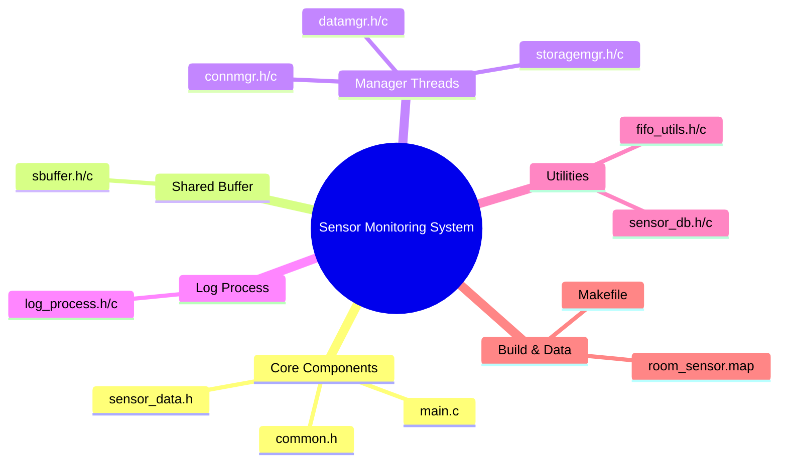

# Sensor Monitoring System

## Introduction

The Sensor Monitoring System is a comprehensive solution designed to collect, analyze, and store temperature data from multiple sensor nodes. This gateway system establishes TCP connections with sensor nodes, processes real-time temperature measurements, detects anomalies, and stores data in a persistent database while maintaining detailed logs of all system activities.

The system is built with a focus on reliability, efficiency, and scalability, capable of handling multiple concurrent sensor connections while maintaining data integrity through thread-safe operations.

## System Architecture

The Sensor Monitoring System follows a multi-process, multi-threaded architecture:

### Main Process
The main process orchestrates the system and contains three specialized threads:

1. **Connection Manager Thread**
   - Manages TCP connections from sensor nodes
   - Handles connection establishment, data reception, and timeouts
   - Uses epoll for efficient I/O multiplexing
   - Validates incoming sensor data and inserts it into the shared buffer

2. **Data Manager Thread**
   - Reads sensor data from the shared buffer (without removing it)
   - Calculates running average temperatures
   - Detects abnormal temperature conditions (too hot/too cold)
   - Generates log events for temperature anomalies

3. **Storage Manager Thread**
   - Reads and removes sensor data from the shared buffer
   - Stores data in SQLite database
   - Handles database connection errors with retry mechanism
   - Creates necessary database tables if they don't exist

### Log Process
A separate child process forked from the main process:
   - Receives log events from all threads via a named FIFO
   - Formats log messages with sequence numbers and timestamps
   - Writes log entries to a dedicated log file

### Communication Mechanisms
1. **Shared Buffer**
   - Thread-safe linked list structure for inter-thread communication
   - Protected by mutex and condition variables
   - Implements producer-consumer pattern with:
     - Connection Manager as producer
     - Data Manager and Storage Manager as consumers

2. **Named FIFO**
   - Used for inter-process communication between Main Process and Log Process
   - Allows asynchronous logging without blocking main operations

Project Structure
The project is organized into the following components:


```
├── main.c                  # Entry point of the program
├── common.h                # Common definitions and constants
├── sensor_data.h           # Sensor data structures and log event definitions
│
├── sbuffer.c/h             # Thread-safe shared buffer implementation
│
├── connmgr.c/h             # Connection manager implementation
├── datamgr.c/h             # Data manager implementation
├── storagemgr.c/h          # Storage manager implementation
│
├── log_process.c/h         # Log process implementation
│
├── sensor_db.c/h           # Sensor-to-room mapping management
├── fifo_utils.c/h          # FIFO utilities for inter-process communication
│
├── Makefile                # Build system
└── room_sensor.map         # Sensor-to-room mapping data file
```

### Core Components:
- **main.c**: Program entry point that initializes resources, creates threads, and manages the main process lifecycle
- **common.h**: Defines constants, error codes, and macros used throughout the system
- **sensor_data.h**: Contains data structures for sensor data and log events

### Buffer Implementation:
- **sbuffer.c/h**: Implementation of a thread-safe shared buffer with mutex and condition variables

### Thread Implementations:
- **connmgr.c/h**: Connection manager thread implementation using epoll for efficient I/O handling
- **datamgr.c/h**: Data manager thread for processing and analyzing temperature data
- **storagemgr.c/h**: Storage manager thread for database operations

### Log Process:
- **log_process.c/h**: Implementation of the separate log process

### Utilities:
- **sensor_db.c/h**: Manages the mapping between sensor IDs and room numbers
- **fifo_utils.c/h**: Utilities for working with named FIFOs in a thread-safe manner

### Build and Data:
- **Makefile**: Configures the build process with various targets
- **room_sensor.map**: Data file containing sensor-to-room mappings